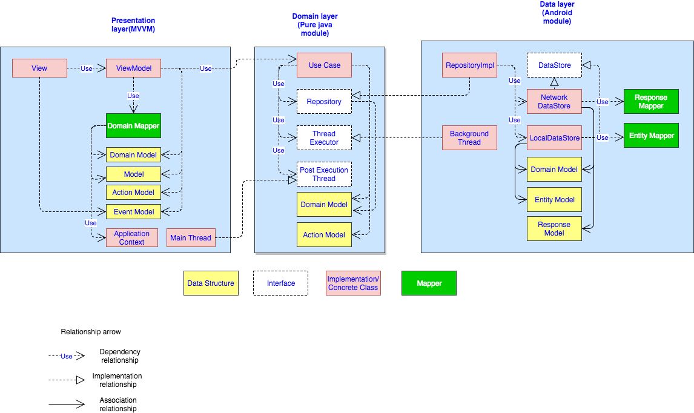

# rx-streamer
RxStreamer utilizes clean-architecture, android view model, dagger and Rxjava to make app reactive and survive configuration changes.

# Clean-MVVM architecture

                                  Loading documentation ...
